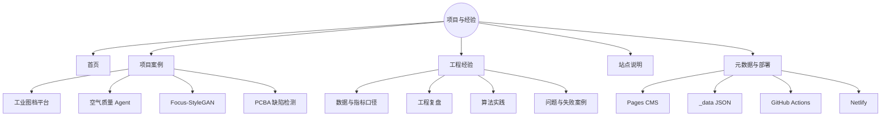
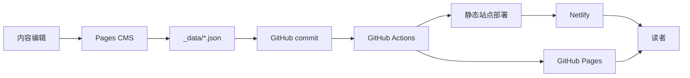
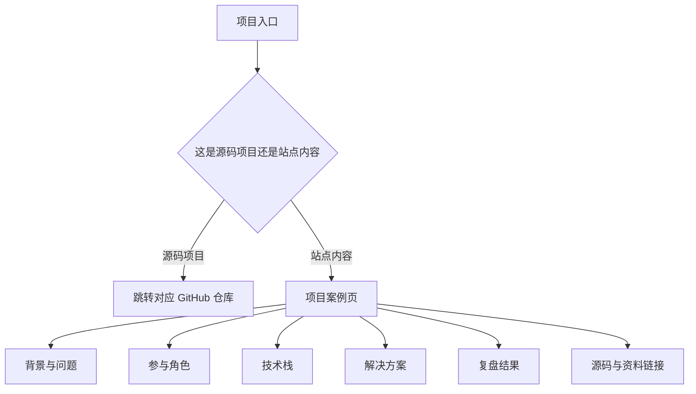
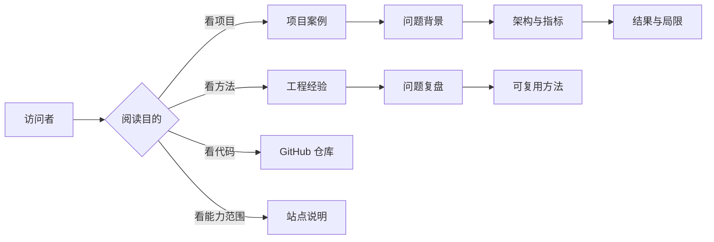
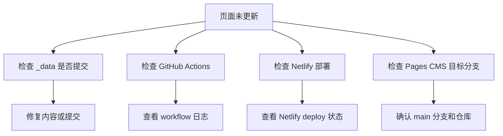
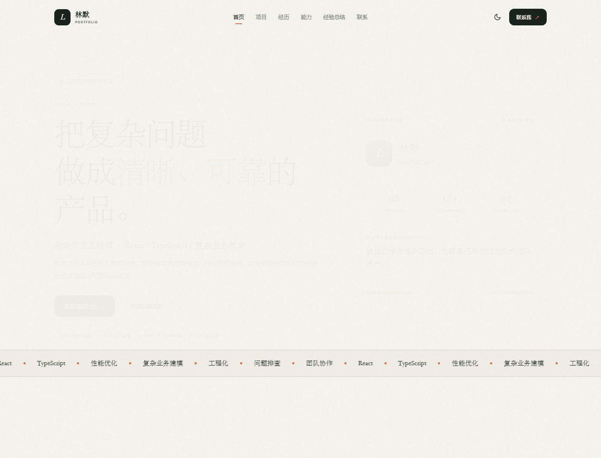
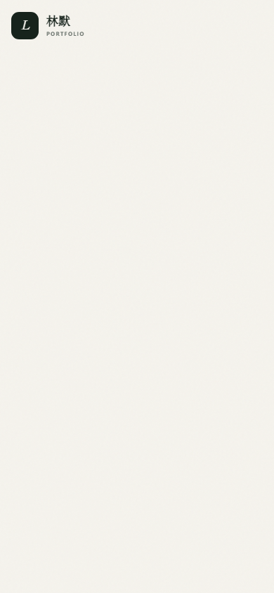

# 项目可视化与可解释性指南

本页用信息架构图、内容生产流程、部署流、内容分类决策树和页面预览说明 `tech-notes` 的内容组织方式。该仓库是个人项目案例与工程经验站点，不替代各项目的源码仓库。

## 图 1：站点信息架构思维导图

## 图 2：内容生产与发布流程

内容更新以 `_data/` 为核心，页面不依赖数据库；GitHub Actions 负责把静态内容发布到部署平台。

## 图 3：项目案例页面结构决策树

## 图 4：内容分类与阅读路径

## 图 5：部署与故障诊断地图

## 页面预览

### 桌面端

解释：用于检查项目卡片、导航、正文层级和桌面布局。

### 移动端

解释：用于检查移动端折叠布局、阅读宽度和导航可用性。

## 视觉阅读顺序

1. 图 1 了解站点有哪些内容和模块。
2. 图 2 理解 CMS、Git 和部署平台如何连接。
3. 图 3 说明项目案例页应该包含哪些信息。
4. 图 4 展示不同读者的阅读路径。
5. 图 5 和预览图用于检查发布流程和页面呈现。